# 🔥 서대문 형무소 탈출 작전 | 완벽 흐름도 및 정답 구조

이 문서는 게임의 **처음부터 끝까지 모든 미션의 흐름과 문제, 그리고 정답**을 완벽한 구조로 담고 있는 최종 흐름도입니다. 수업 전 미리 참고하시면 학생들의 진행 상황을 완벽하게 파악하실 수 있습니다.

---

## 🗺️ 전체 문제 및 정답 흐름도 (Flowchart)

```mermaid
flowchart TD
    %% 1. 도입부
    Start([🚀 게임 시작]) --> Intro[🎬 영상 재생: 인트로.mp4]
    Intro --> M0[📌 신분증 위조\n이름 / 학반 / 번호 입력]
    
    %% 2. 미션 1 ~ 1.5
    M0 --> M1[Q1. 위장 잠입\n문제: 신분 위장 직업 선택 및 이유 작성\n🔑 열쇠 1 획득]
    M1 -.->|정답: 아무 직업 선택 + 이유 5글자 이상 작성| M1_5[Q2. 을사오적\n문제: 1905년 나라를 판 학부대신 이름은?\n🔑 열쇠 11 획득]
    M1_5 -.->|정답: 이완용| V1[🎬 영상 재생: 고문실 이동]
    
    %% 3. 미션 2 ~ 3
    V1 --> M2[Q3. 취조실 고문\n문제: 잃지 말아야 할 네 글자의 신념은?\n🔑 열쇠 2 획득]
    M2 -.->|정답: 대한독립| M3[Q4. 마스터 자물쇠\n문제: 서대문형무소 건립 연도 + 유관순 순국 연도\n🔑 열쇠 3 획득]
    
    %% 4. 긴장 이벤트 1 ~ 미션 4
    M3 -.->|정답: 24530819| E1{{🚨 긴장 이벤트 1: 간수 출현!\n심장 소리 + 3초 대기}}
    E1 --> V2[🎬 영상 재생: 먹방 이동]
    V2 --> M4[Q5. 타음통신\n문제: 벽에서 들리는 '쿵' 소리의 횟수는?\n🔑 열쇠 4 획득]
    
    %% 5. 미션 5 ~ 긴장 이벤트 2 ~ 미션 6
    M4 -.->|정답: 815| M5[Q6. 공작사 맵 통과\n문제: 간수를 피해 모든 안전 구역을 지나 독방 도착\n🔑 열쇠 5 획득]
    M5 -.->|정답: 23개 빈칸 모두 한 번씩 통과| E2{{🚨 긴장 이벤트 2: 열쇠 찾기!\n수많은 이모티콘 중 진짜 🗝️ 찾기}}
    E2 --> M6[Q7. 격벽장 구조\n문제: 운동장의 모양 / 동시 수용 인원 / 중앙 통제 건물\n🔑 열쇠 6 획득]
    
    %% 6. 미션 7 ~ 7.5
    M6 -.->|정답: 부채꼴, 10, 중앙감시대| M7[Q8. 여옥사 순찰 달력\n문제: 달력 규칙을 보고 다음 순찰 시간 맞추기\n🔑 열쇠 7 획득]
    M7 -.->|정답: 1117| M7_5[Q9. 의열투사 매칭\n문제: 이토 처단 / 훙커우 공원 / 총독 폭탄 투척\n🔑 열쇠 12 획득]
    
    %% 7. 긴장 이벤트 3 ~ 미션 8 ~ 9
    M7_5 -.->|정답: 안중근 / 윤봉길 / 강우규| E3{{🚨 긴장 이벤트 3: 간수 출현!\n심장 소리 + 3초 대기}}
    E3 --> M8[Q10. 유관순 수감번호\n문제: 8호 감방 수감 번호는?\n🔑 열쇠 8 획득]
    M8 -.->|정답: 371| M9[Q11. 사형장 마지막 기록\n문제: 마지막 유언 작성하기\n🔑 열쇠 9 획득]
    
    %% 8. 인증샷 및 미션 10 (엔딩)
    M9 -.->|정답: 진심을 담아 5글자 이상 작성| V3[🎬 영상 재생: 추모비 이동]
    V3 --> Photo[📷 현장 인증샷\n문제: 유관순 방 또는 미루나무 사진 업로드]
    Photo -->|사진 첨부| M10[Q12. 추모비 다짐\n문제: 앞으로의 진로 선택 및 기여할 다짐 작성]
    M10 -.->|정답: 진로 선택 + 다짐 5글자 이상 작성| End([🎉 탈출 성공증 발급 및 엔딩 영상 재생])
```

---

## 📝 텍스트로 보는 미션별 문제와 정답 (진행 순서)

1. **[영상]** 인트로 재생 (`1. 인트로.mp4`)
2. **[요원 등록]** 이름 / 학반 / 번호 입력
3. **[Q1] 위장 잠입**
   - **문제**: 신분을 위장할 직업을 선택하고 그럴듯한 이유를 적으시오.
   - **정답**: 5글자 이상 이유 작성 (예: 약 배달 왔소이다)
4. **[Q2] 을사오적**
   - **문제**: 1905년 을사늑약 당시 학부대신으로 나라를 팔아넘긴 인물은?
   - **정답**: `이완용`
5. **[영상]** 고문실 이동 영상 재생
6. **[Q3] 취조실 고문**
   - **문제**: 고통 속에서도 잃지 말아야 할 네 글자의 신념을 외치시오.
   - **정답**: `대한독립` (또는 독립만세, 대한만세)
7. **[Q4] 마스터 자물쇠 (벽관)**
   - **문제**: 서대문형무소가 지어진 연도 + 유관순 열사 순국 연도를 조합해 비밀번호를 푸시오.
   - **정답**: `24530819`
8. 🚨 **[이벤트] 간수 출현**: 발소리와 심장 소리 재생, 강제로 3초 숨죽여 대기
9. **[영상]** 먹방 이동 영상 재생
10. **[Q5] 먹방 타음 통신**
    - **문제**: 벽 너머 동지가 두드리는 '쿵' 소리의 횟수 암호를 알아내시오. (쿵x8, 쿵x1, 쿵x5)
    - **정답**: `815`
11. **[Q6] 공작사 순찰 피하기 (미로)**
    - **문제**: 간수를 피해 모든 안전 구역(빈칸)을 지나 독방 목적지(X)로 가시오.
    - **정답**: 23개의 빈칸을 빠짐없이 한 번씩 클릭하여 통과
12. 🚨 **[이벤트] 숨은 열쇠 찾기**: 수많은 이모티콘 틈에서 실제 `🗝️(열쇠)` 모양을 재빨리 클릭하기
13. **[Q7] 격벽장 구조**
    - **문제**: 운동장 모양, 동시 수용 인원, 가운데 건물을 맞추시오.
    - **정답**: `부채꼴`, `10`, `중앙감시대`
14. **[Q8] 여옥사 순찰 달력**
    - **문제**: 달력에 적힌 시간을 보고 규칙을 파악해 다음 순찰 시간을 맞추시오.
    - **정답**: `1117`
15. **[Q9] 의열투사 매칭**
    - **문제**: 이토 히로부미 처단, 훙커우 공원 폭탄, 사이토 총독 폭탄 투척 인물을 맞추시오.
    - **정답**: ①`안중근` / ②`윤봉길` / ③`강우규`
16. 🚨 **[이벤트] 간수 출현**: 여옥사 진입 전 한 번 더 3초간 숨죽여 대기
17. **[Q10] 여옥사 8호 감방**
    - **문제**: 유관순 열사의 수감 번호를 선택하시오.
    - **정답**: `371`
18. **[Q11] 사형장 마지막 기록**
    - **문제**: 형장의 이슬로 사라지기 전 마지막 유언을 남기시오.
    - **정답**: 5글자 이상 작성
19. **[영상]** 추모비 이동 영상 재생
20. **[Q12] 현장 사진 인증**
    - **문제**: 유관순 방 또는 미루나무가 보이게 인증샷을 찍으시오.
    - **정답**: 기기에서 사진 파일 업로드
21. **[Q13] 추모비 다짐**
    - **문제**: 앞으로의 진로를 선택하고 독립투사들께 남기는 굳은 다짐을 적으시오.
    - **정답**: 진로 선택 후 5글자 이상 작성
22. **[종료] 엔딩 영상 재생 및 최종 요원 탈출증(수료증) 발급**
